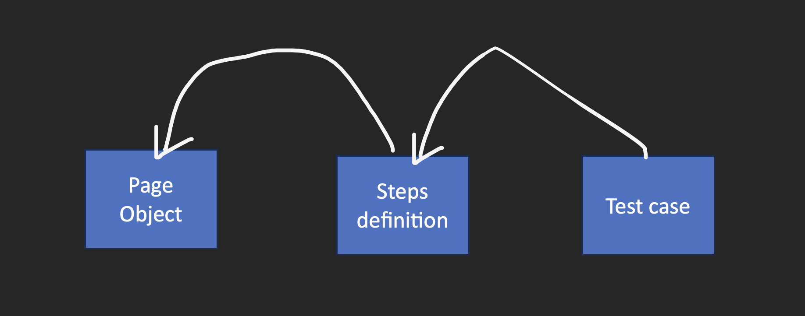
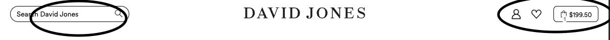
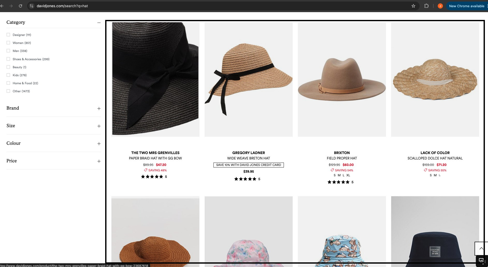
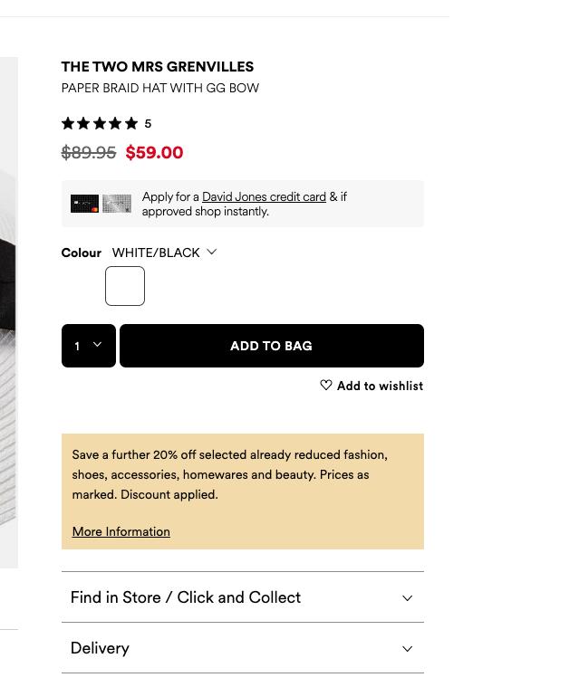
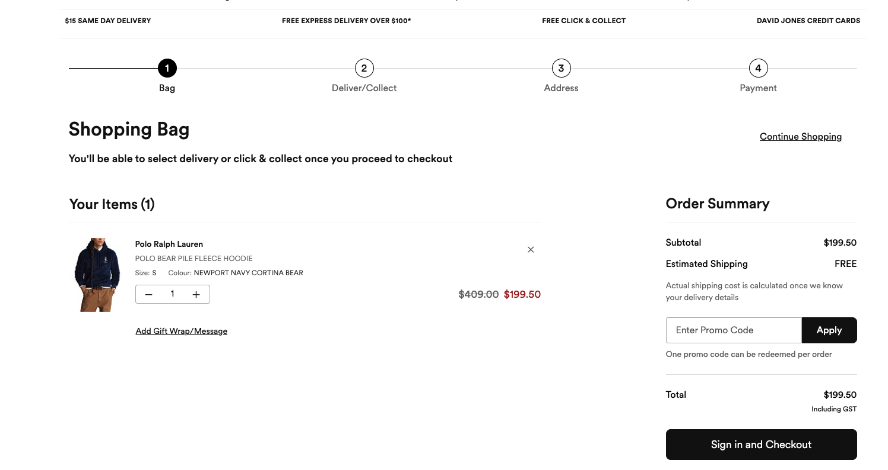
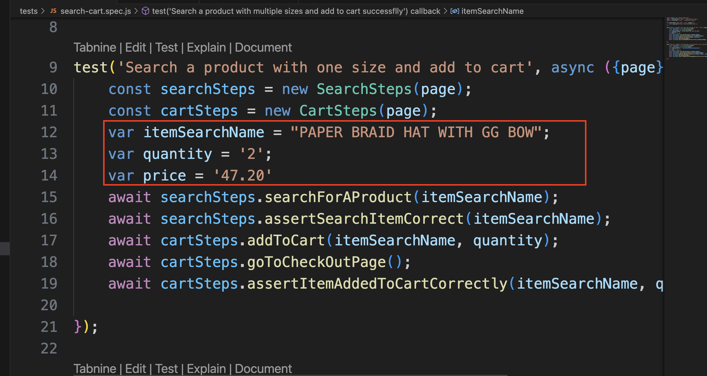
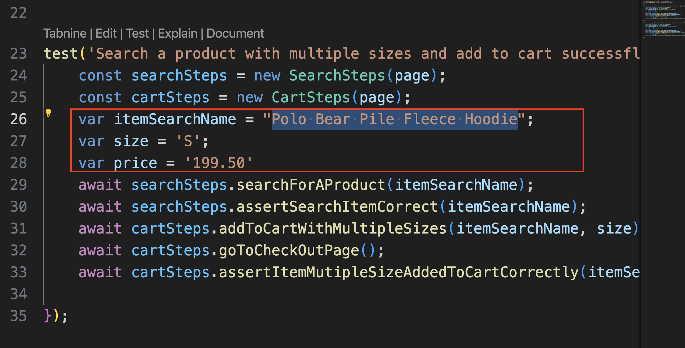

# mytest
### 1. How to run test
    * Clone project to your local by  command: git clone https://github.com/Dinh263/mytest.git

    * Go to the root folder of project: cd /mytest/mytest/myapp you will see a file call package.json

    * Run the following command to install libs: npm install

    * To run the test, stay at the same folder with 'package.json' and run comand: npx playwrigh test --project chromium --headed

### 2. Project description
    This project is structured with model: pages, stepdefinitions and test. 

    Pages folder: where you define page of model. Location: /myapp/pages/

    Steps folder: where you define steps of your test case. Location: /myapp/steps/

    Test folder: where you define test case. Location: /myapp/tests/

### 3. How project works
* The main idea/flow is: your test case will called steps definitions and steps definition will call page object. The test case will not call directly to page object.

* Pages object: where you define classes which mapped to your web page. (check more detail as section 4 )

* Stepdefinitions object: where you combine mono steps of different classes in page object to 1 function. Ex:       SearchSteps: will create some functions incluse all steps of search a product.
cart steps: will create some functions related to add proect to cart and check out.

* Test case: where you call function in stepdefinitions.

### 4. Page Object Mapping
    Header.page.js will be mapped to this screen

    Content.page.js will be mapped to this screen 

    Itemdetail.page.js will be mapped to this screen

    Checkout.page.js will be mapped to this screen

### 5. Logic of test case
There are 2 test cases.

    Test case 1 : search a product which has only 1 size and verify add to cart successfully.

step 1: open the site: https://www.davidjones.com/

step 2: input the keyword: "PAPER BRAID HAT WITH GG BOW" and click button "Search" on the Header section.

step 3: wait for screen show all items result.

step 4: due to some items has the name not match with the keyword we inputted. Then we try to loop through the item result and check if any item has matched the name inputted then we pass. If not item found then fail test case.

step 5: click on the item to go to detail page of item.

step 6: on detail page, we select quantity 

step 7: we check out, at the check out page, we validate: 
* item name is correct
* quantity is correct 
* price is correct.

.

    Test case 2 : search a product which has only multiple size and verify add to cart successfully.

step 1: open the site: https://www.davidjones.com/

step 2: input the keyword: "Polo Bear Pile Fleece Hoodie" and click button "Search" on the Header section.

step 3: wait for screen show all items result.

step 4: due to some items has the name not match with the keyword we inputted. Then we try to loop through the item result and check if any item has matched the name inputted then we pass. If not item found then fail test case.

step 5: click on the item to go to detail page of item.

step 6: on detail page, we select size. 

step 7: we check out, at the check out page, we validate: 
* item name is correct
* size is correct 
* price is correct.

### 6. How to change data for testing
    you can change data with your own. But keep in mind that: for test case 1 we check item which has only 1 size and it will be different with test case 2 where item has multiple size.

    for test data of test 1. you will find in line 

    for test data of test 2. you will find in line 

